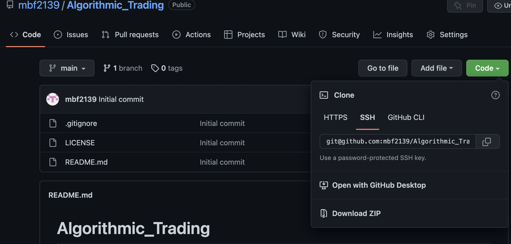
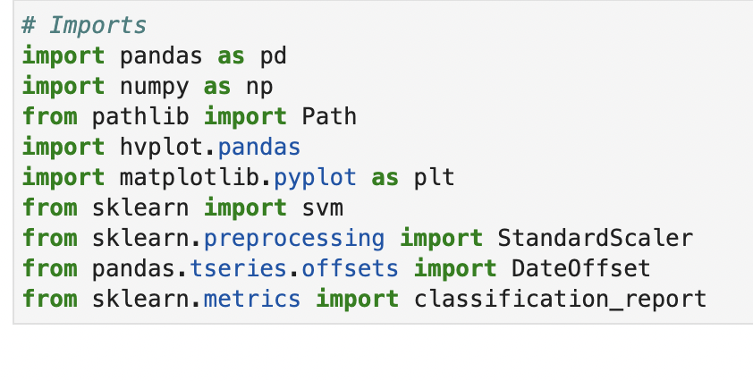
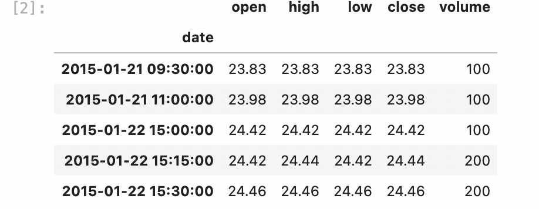
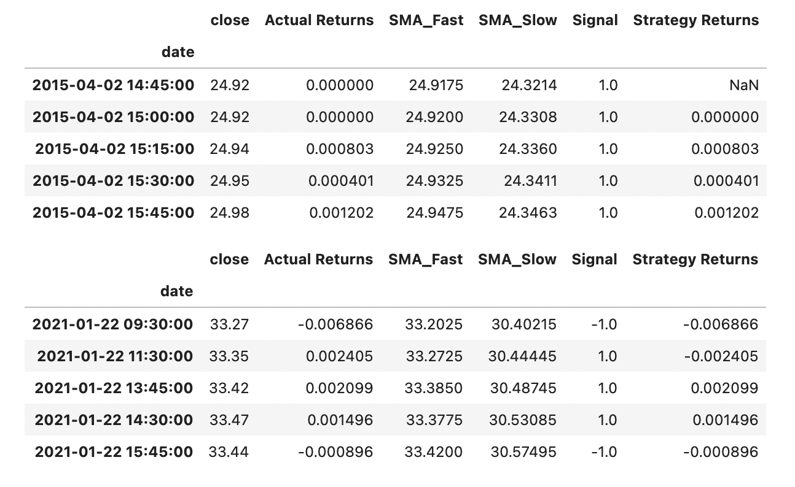
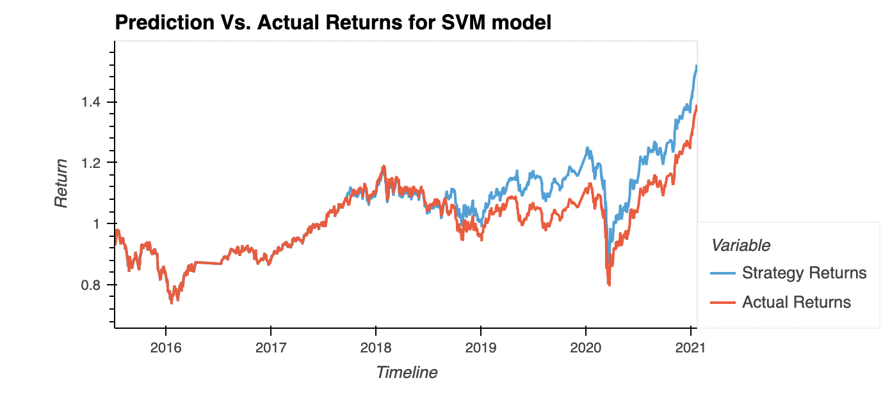
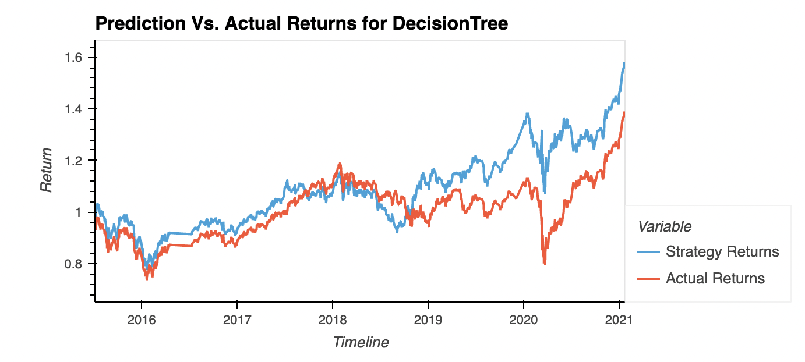

# Algorithmic_Trading

algorithmic trading bot that learns and adapts to new data and evolving markets

---
## Technologies 

* [pandas](https://github.com/pandas-dev/pandas) - For data analysis and manipulation.
* [numpy](https://github.com/numpy/numpy) - For scientific computing with Python
* [scikit-learn](https://github.com/scikit-learn/scikit-learn) - For ML modeling and predictions 
* [hvplot](https://github.com/holoviz/hvplot) - For interactive data visualizations 
* [matplotlib](https://github.com/matplotlib/matplotlib) - For data viz

---

## Installation 

1. Clone the repo

         
---

## Usage

1. Open the ***machine_learning_trading_bot.ipynb*** file within the Algorithmic_Trading Repo 

2. Run all neccesary import 

3. Import data 

4. Generate trading signals and calculate returns 

5. Run SVM and compare returns

6. Run DecisionTree and compare returns 

---

## Analysis

SVM has a stronger recall and precision for the buy signal (1) and an overall better accuracy score. Decison tree is better at predicting the sell (-1) but is overall less accurate and does not track the actual returns as closely throughout. Both are viable models with stronger strategy returns than actual, but SVM is a stronger model in this case. 

---

## Contributors

The starter code was contributed by the [FinTech Bootcamp at Columbia Engineering](https://bootcamp.cvn.columbia.edu/fintech/)

Matthew Field finalized the application, his work is availble to view on [Github](https://github.com/mbf2139)

---

## License

MIT
